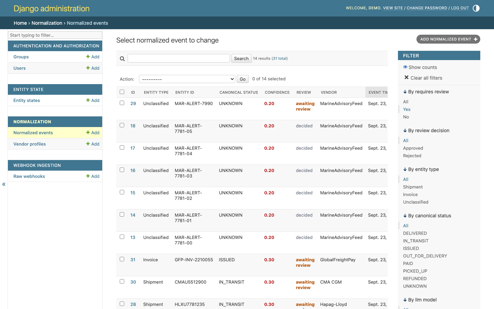
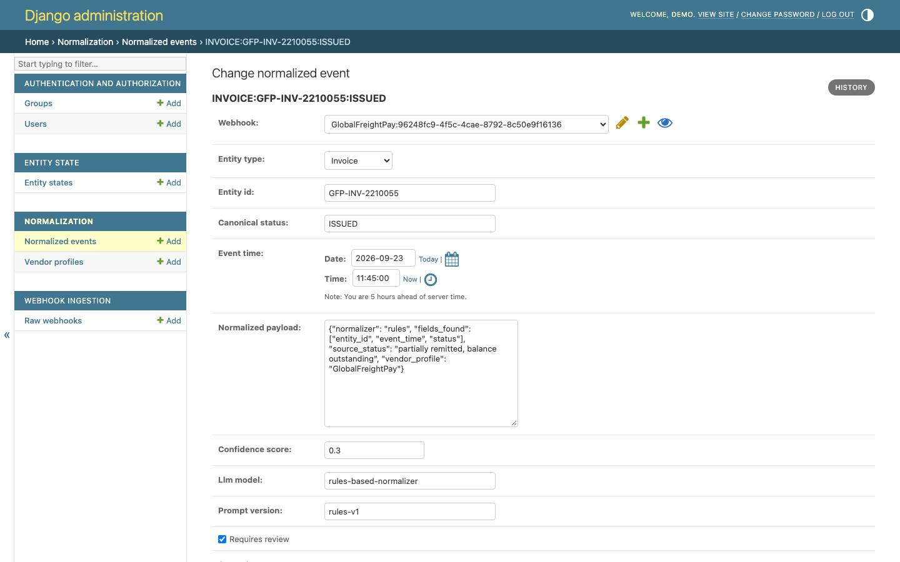
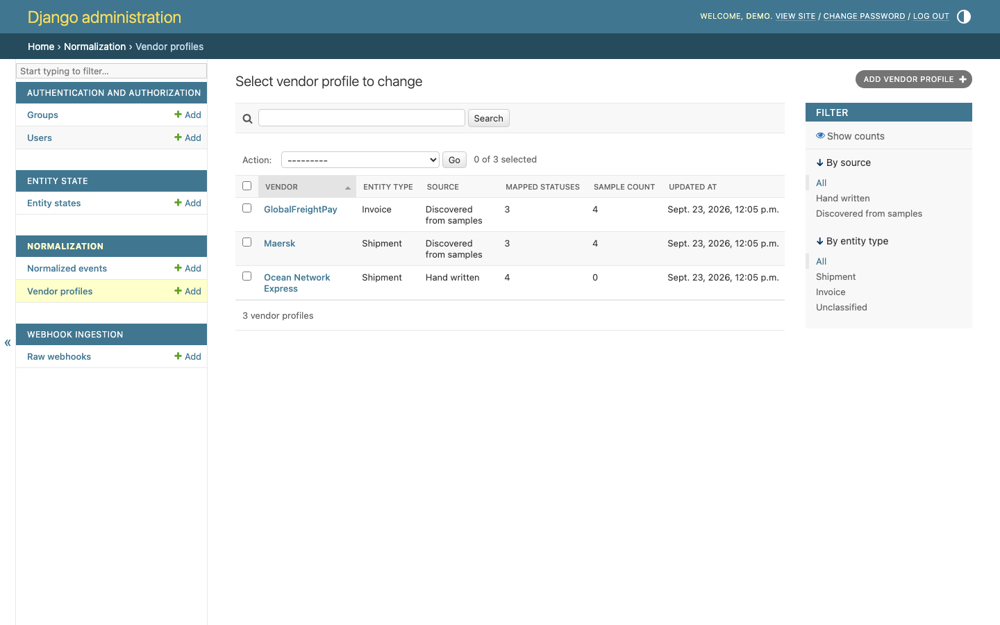
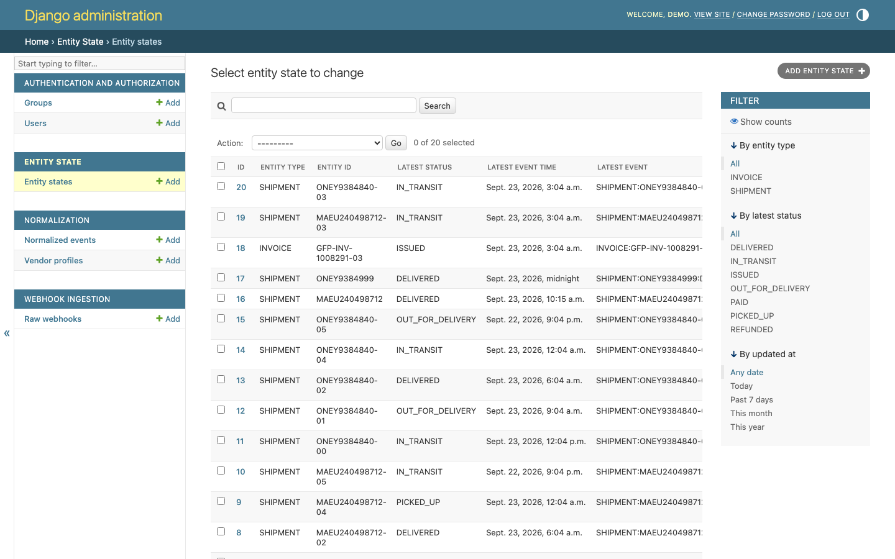
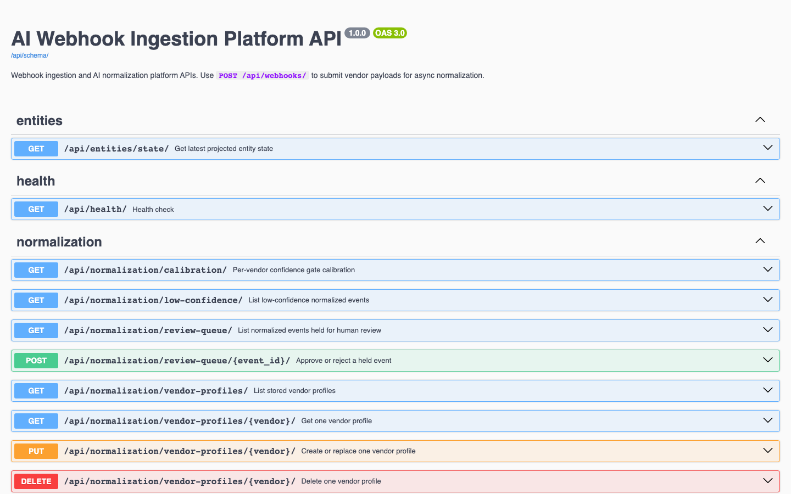
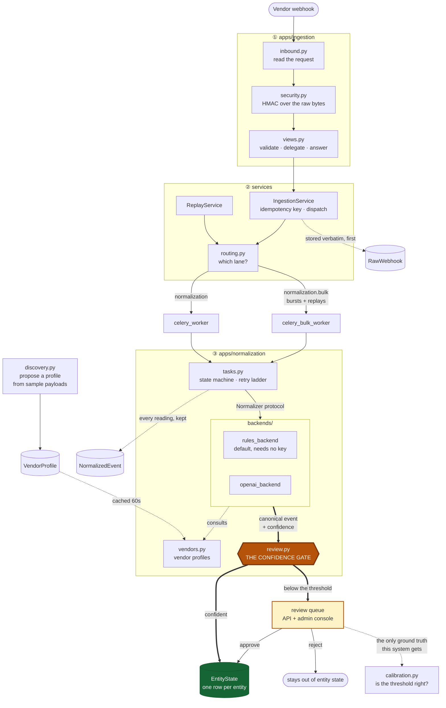
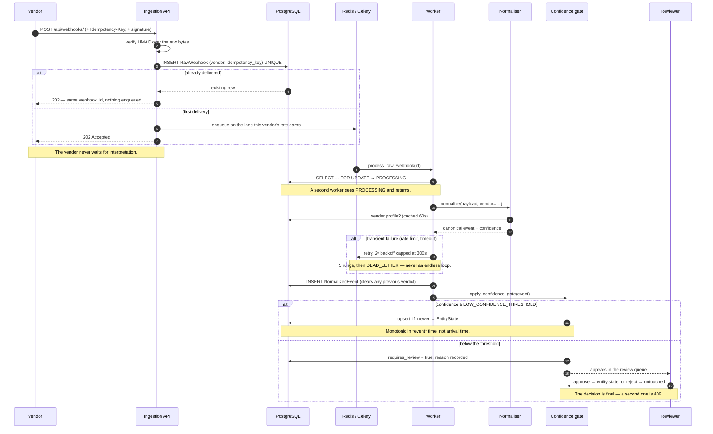

# Webhook Ingestion & Normalisation Service

Every vendor describes the same event differently. One says
`{"event": "delivered"}`, another `{"status_text": "Cargo released to consignee"}`,
a third `{"type": "parcel.out_for_delivery"}`. This service accepts all of them
and answers one question consistently: **what is the current status of this
shipment or invoice?**

Django 5 + DRF, Celery, PostgreSQL, Redis. An LLM does the interpreting when an
API key is present; a rule engine does it when one is not, and the service is
fully functional either way.

The interesting part is not that a model reads the payloads. It is that the
service **refuses to act on a reading it isn't sure about**: a low-confidence
normalisation is recorded in full but withheld from the system's state until a
person approves it. That gate is the centre of the design, and everything else
here — the queue, the retry ladder, vendor profiles, replay, calibration —
exists to make it either less necessary or easier to work.

---

## It working

No UI was invented for this service; it is an API and two Celery workers. What
follows is real output from the stack that `docker compose up` starts, captured
against ports 8100–8102.

### One command, five containers

```console
$ docker compose up -d
$ docker compose ps
NAME                  STATUS                   PORTS
webhook_bulk_worker   Up 2 minutes (healthy)   8000/tcp
webhook_postgres      Up 2 minutes (healthy)   0.0.0.0:8101->5432/tcp
webhook_redis         Up 2 minutes (healthy)   0.0.0.0:8102->6379/tcp
webhook_web           Up 2 minutes (healthy)   0.0.0.0:8100->8000/tcp
webhook_worker        Up 2 minutes (healthy)   8000/tcp
```

The web container migrates and seeds before it serves, so a fresh boot is worth
looking at rather than empty:

```console
webhook_web  |   Applying normalization.0003_vendorprofile_normalizedevent_review_decision_and_more... OK
webhook_web  | Created demo superuser 'demo'. This is a demo credential: do not pass --admin-password in any deployment that matters.
webhook_web  | Seeded 24 new webhook(s), skipped 0 already present. 24 stored, 20 awaiting the worker.
```

### A delivery the normaliser understands

```console
$ curl -s -X POST http://localhost:8100/api/webhooks/ \
    -H 'Content-Type: application/json' \
    -H 'X-Webhook-Vendor: Maersk' \
    -H 'Idempotency-Key: MRSK-EVT-2026-000911' \
    -d '{"container_no":"MAEU240498712","event_description":"delivered",
         "event_time":"2026-09-23T10:15:00+00:00","location":"NLRTM"}'
{
    "status": "accepted",
    "webhook_id": "9bdb4277-87ac-404c-8159-23e94031bffc"
}

$ curl -s 'http://localhost:8100/api/entities/state/?entity_type=SHIPMENT&entity_id=MAEU240498712'
{
    "entity_type": "SHIPMENT",
    "entity_id": "MAEU240498712",
    "latest_status": "DELIVERED",
    "latest_event_time": "2026-09-23T10:15:00Z",
    "latest_event_id": 25
}
```

The same `Idempotency-Key` again, with a different body, is the same webhook —
no second row, no second normalisation:

```console
$ curl -s -X POST http://localhost:8100/api/webhooks/ ... -d '{...,"redelivery":2}'
{
    "status": "accepted",
    "webhook_id": "9bdb4277-87ac-404c-8159-23e94031bffc"
}
```

### A delivery it does not understand

`"Cargo released to consignee"` is not in the canonical vocabulary. The
normaliser abstains rather than guessing, and the gate holds the event:

```console
$ curl -s -X POST http://localhost:8100/api/webhooks/ \
    -H 'X-Webhook-Vendor: Ocean Network Express' -H 'Idempotency-Key: ONE-778999-A' \
    -d '{"shipment_reference":"ONEY9384999","status_text":"Cargo released to consignee",
         "occurred_at":"2026-09-23T09:00:00+09:00","port":"JPYOK"}'
{"status": "accepted", "webhook_id": "611b09ac-c26b-49b7-a72f-1a4701096271"}

$ curl -s -G http://localhost:8100/api/normalization/review-queue/ \
    --data-urlencode 'vendor=Ocean Network Express' --data-urlencode 'limit=1'
{
    "count": 2,
    "limit": 1,
    "offset": 0,
    "next_offset": 1,
    "previous_offset": null,
    "results": [
        {
            "id": 22,
            "vendor": "Ocean Network Express",
            "entity_type": "SHIPMENT",
            "entity_id": "ONEY9384840-03",
            "canonical_status": "IN_TRANSIT",
            "confidence_score": 0.3,
            "llm_model": "rules-based-normalizer",
            "requires_review": true,
            "review_reason": "confidence 0.30 is below the 0.70 threshold",
            "review_decision": "",
            "reviewed_at": null
        }
    ]
}

$ curl -s -w '\nHTTP %{http_code}\n' \
    'http://localhost:8100/api/entities/state/?entity_type=SHIPMENT&entity_id=ONEY9384999'
{"detail":"Not found."}
HTTP 404
```

Nothing was lost and nothing was asserted. The worker says why, in one line:

```console
$ docker compose logs celery_worker | grep held_for_review
{"timestamp": "2026-09-23T12:05:11.588171+00:00", "level": "WARNING",
 "logger": "apps.normalization", "message": "normalization_held_for_review",
 "correlation_id": null, "event_id": 26, "entity_id": "ONEY9384999",
 "confidence": 0.3, "threshold": 0.7}
```

### Teaching it the vendor, instead of reviewing the vendor forever

Hand the discovery endpoint a few real payloads and it proposes where the
identifier, status and timestamp live, and what the vendor's words mean:

```console
$ curl -s -X POST http://localhost:8100/api/normalization/vendor-profiles/discover/ \
    -H 'Content-Type: application/json' -d @samples-one.json
{
    "method": "statistical",
    "sample_count": 4,
    "unmapped_statuses": [
        "cargo_released_to_consignee"
    ],
    "warnings": [],
    "profile": {
        "vendor": "Ocean Network Express",
        "entity_type": "SHIPMENT",
        "id_paths": ["shipment_reference", "externalEventId", "status_text"],
        "status_paths": ["status_text", "port"],
        "time_paths": ["occurred_at"],
        "status_map": {
            "delivered": "DELIVERED",
            "in_transit": "IN_TRANSIT",
            "out_for_delivery": "OUT_FOR_DELIVERY"
        },
        "source": "DISCOVERED",
        "sample_count": 4,
        "notes": ""
    },
    "persisted": true
}
```

Note what it did **not** do: it left `cargo_released_to_consignee` unmapped and
said so, rather than inventing a meaning for it. A person supplies that, and
tightens the paths while they are there:

```console
$ curl -s -X PUT 'http://localhost:8100/api/normalization/vendor-profiles/Ocean%20Network%20Express/' \
    -H 'Content-Type: application/json' -d '{
      "entity_type": "SHIPMENT",
      "id_paths": ["shipment_reference"],
      "status_paths": ["status_text"],
      "time_paths": ["occurred_at"],
      "status_map": {"cargo_released_to_consignee": "DELIVERED",
                     "delivered": "DELIVERED", "in_transit": "IN_TRANSIT",
                     "out_for_delivery": "OUT_FOR_DELIVERY"},
      "notes": "Reviewed by ops: the free-text release phrase means delivered."}'
{"vendor": "Ocean Network Express", "source": "MANUAL", "sample_count": 0, ...}
```

Now replay the webhook that was held. The raw payload was stored before anything
interpreted it, so there is something to replay:

```console
$ curl -s -X POST http://localhost:8100/api/webhooks/611b09ac-.../replay/ -d '{"force": true}'
{
    "status": "accepted",
    "webhook_id": "611b09ac-c26b-49b7-a72f-1a4701096271",
    "processing_status": "RECEIVED"
}

$ curl -s -G http://localhost:8100/api/normalization/review-queue/ \
    --data-urlencode 'vendor=Ocean Network Express'
{"count": 1, "limit": 50, "offset": 0, "next_offset": null}     # was 2

$ curl -s 'http://localhost:8100/api/entities/state/?entity_type=SHIPMENT&entity_id=ONEY9384999'
{
    "entity_type": "SHIPMENT",
    "entity_id": "ONEY9384999",
    "latest_status": "DELIVERED",
    "latest_event_time": "2026-09-23T00:00:00Z",
    "latest_event_id": 26
}
```

The event left the queue without anybody ruling on it, because the normaliser
now understands the vendor and the replay cleared the stale verdict.

### Working the queue by hand

```console
$ curl -s -X POST http://localhost:8100/api/normalization/review-queue/4/ \
    -H 'Content-Type: application/json' -d '{"decision":"approve"}'
{"id": 4, "decision": "approve", "entity_state_updated": true}

$ curl -s 'http://localhost:8100/api/entities/state/?entity_type=INVOICE&entity_id=GFP-INV-1008291-03'
{"entity_type": "INVOICE", "entity_id": "GFP-INV-1008291-03",
 "latest_status": "ISSUED", "latest_event_id": 4}

$ # the same event a second time
{"detail":"event 4 was already reviewed at 2026-09-23 12:05:41.750779+00:00"}
HTTP 409

$ # rejections leave entity state exactly as it was
{"id": 13, "decision": "reject", "entity_state_updated": false}
{"id": 14, "decision": "reject", "entity_state_updated": false}
```

### Is the threshold in the right place?

```console
$ docker compose exec web python manage.py calibration_report
Confidence gate calibration (threshold 0.70)
vendor                    events   held   hold%  appr  rej  verdict
-------------------------------------------------------------------
CMA CGM                        1      1  100.0%     0    0  insufficient_decisions
GlobalFreightPay               7      2   28.6%     1    0  insufficient_decisions
Hapag-Lloyd                    2      2  100.0%     0    0  insufficient_decisions
Maersk                         7      1   14.3%     1    0  insufficient_decisions
MarineAdvisoryFeed             7      7  100.0%     0    6  all_rejected
NoisyCarrier                   9      0    0.0%     0    0  insufficient_decisions
Ocean Network Express          7      1   14.3%     1    0  insufficient_decisions

MarineAdvisoryFeed: every held event was rejected, so the gate is earning its
  keep here; the data cannot say whether it should hold more
Maersk: only 1 decision(s) on file; 5 needed before the threshold is worth moving
```

### One noisy vendor does not become everybody's latency

With `NOISY_VENDOR_BURST=5` (200 by default) and nine webhooks from one vendor,
the first five take the live lane and the rest are bulkheaded onto the bulk
lane, which has its own worker:

```console
{"message": "webhook_accepted",        "vendor": "NoisyCarrier", "queue": "normalization"}
{"message": "webhook_accepted",        "vendor": "NoisyCarrier", "queue": "normalization"}
{"message": "webhook_accepted",        "vendor": "NoisyCarrier", "queue": "normalization"}
{"message": "webhook_accepted",        "vendor": "NoisyCarrier", "queue": "normalization"}
{"message": "webhook_accepted",        "vendor": "NoisyCarrier", "queue": "normalization"}
{"message": "vendor_burst_bulkheaded", "vendor": "NoisyCarrier", "queue": "normalization.bulk", "arrivals": 6}
{"message": "webhook_accepted",        "vendor": "NoisyCarrier", "queue": "normalization.bulk"}
{"message": "webhook_accepted",        "vendor": "NoisyCarrier", "queue": "normalization.bulk"}
{"message": "webhook_accepted",        "vendor": "NoisyCarrier", "queue": "normalization.bulk"}
{"message": "webhook_accepted",        "vendor": "NoisyCarrier", "queue": "normalization.bulk"}

$ docker compose logs celery_bulk_worker | grep -c webhook_processed
4
```

### Onboarding a vendor from what it has already sent

```console
$ docker compose exec web python manage.py discover_vendor_profile "Hapag-Lloyd" --from-stored 20
Hapag-Lloyd  (statistical, 2 sample(s))
  entity_type   SHIPMENT
  id_paths      container_no, status
  status_paths  status
  time_paths    event_time
  status_map
    (none)
  unmapped status: awaiting_vessel_space_allocation
  unmapped status: held_at_customs_pending_inspection

Proposal only. Re-run with --persist to save it, or edit it in the admin.
```

### The review console

The console is the Django admin at `/admin/`, deliberately: the gate needs a
queue somebody can work, and a bespoke frontend would be a lot of ceremony for a
table with two actions. The admin actions call the same
`apply_review_decision()` the API does, so a decision made in either place
cannot drift from the other.



Confidence is coloured by the gate's own verdict rather than by a threshold
hardcoded in the template, so the display cannot disagree with the pipeline.
Amber rows are waiting on a person; grey ones have been ruled on.



The event the gate held, with the reason attached: the normaliser recorded which
fields it actually found, what the vendor's raw status word was, and which
vendor profile (if any) answered. That is what a reviewer needs to decide.



Profiles, and whether each was hand-written or discovered from samples. The
common workflow is to run discovery, read the status map, fill in the words it
left unmapped, and save.



The output: one row per shipment or invoice, holding the latest status that
cleared the gate.



---

## Architecture

A **layered Django project with a repository layer and a pluggable normaliser**.
Dependencies point inward: views know about services, services know about
repositories and domain rules, and nothing in the domain imports a view or a
vendor SDK.



Four rules hold this together:

1. **The raw payload is stored before anything interprets it.** Interpretation
   is derived data, and derived data must be reproducible from something that
   is not. This is what makes replay possible.
2. **Acceptance is decoupled from understanding.** The vendor gets `202` as soon
   as the payload is durable. Vendors retry aggressively on slow responses, so
   interpreting inline would turn a slow model call into duplicate deliveries.
3. **The trust rule is written once.** `review.py` is the only place that
   decides whether a normalisation becomes the system's belief. Three callers
   need it — the Celery task, the review API, the admin console — and a rule
   about trust written down three times will eventually disagree with itself.
4. **Backends depend on a protocol, not the reverse.** The task calls
   `Normalizer.normalize()`; whether a model or a lookup table answers is a
   configuration detail.

### How a webhook becomes a fact



---

## Quickstart

```bash
docker compose up --build
```

That is the whole thing. It starts PostgreSQL, Redis, the web process and two
Celery workers, runs the migrations, seeds four vendors' worth of traffic and
creates a demo admin login — no manual steps.

- **API docs:** <http://localhost:8100/api/docs/>
- **Review console:** <http://localhost:8100/admin/> — `demo` / `demo-password`
- **Health:** <http://localhost:8100/api/health/>

**No API key is required.** With `OPENAI_API_KEY` unset the service selects the
rule-based normaliser and everything works: ingestion, idempotency, the queue,
the retry ladder, vendor profiles, the gate, the review workflow and entity
state. Add a key to switch to the model; nothing else changes.

Send some traffic at it:

```bash
python scripts/send_webhooks.py --count 20
```

Ports are 8100 (web), 8101 (PostgreSQL) and 8102 (Redis).

---

## Configuration

Every value has a working default and `.env` is optional; `docker compose`
supplies its own. `.env.example` is the full list.

| Variable | Required | Default | What it does |
|---|---|---|---|
| `DJANGO_SECRET_KEY` | for real deployments | `unsafe-default-key` | Django signing key. Compose sets an explicitly insecure one |
| `DEBUG` | no | `0` | Django debug mode |
| `DJANGO_ALLOWED_HOSTS` | no | `*` in compose | Comma-separated host allowlist |
| `TIME_ZONE` | no | `UTC` | Server time zone |
| `POSTGRES_DB` / `_USER` / `_PASSWORD` | no | `webhooks` | Database credentials |
| `POSTGRES_HOST` / `_PORT` | no | `postgres` / `5432` | Database location |
| `DB_CONN_MAX_AGE` | no | `60` | Seconds a connection is reused |
| `REDIS_URL` | no | `redis://redis:6379/0` | Broker default |
| `CELERY_BROKER_URL` | no | `REDIS_URL` | Celery broker |
| `CELERY_RESULT_BACKEND` | no | `REDIS_URL` | Celery results |
| `CELERY_TASK_TIME_LIMIT` / `_SOFT_TIME_LIMIT` | no | `120` / `90` | Worker task limits, seconds |
| `CACHE_URL` | no | empty → in-process | Redis URL backing vendor profiles and the arrival counter. **Set it whenever more than one process runs** |
| `NORMALIZATION_BACKEND` | no | `auto` | `auto`, `openai` or `rules`. `auto` picks `openai` iff a key is set |
| `OPENAI_API_KEY` | no | empty | Present ⇒ model backend. Absent ⇒ rules, and no billable call is ever made |
| `OPENAI_MODEL` | no | `gpt-4.1-mini` | Model used when a key is set |
| `OPENAI_TIMEOUT_SECONDS` | no | `30` | Per-call timeout; a timeout is retryable |
| `NORMALIZATION_PROMPT_VERSION` | no | `v1` | Recorded on every event, so a prompt change is attributable |
| `LOW_CONFIDENCE_THRESHOLD` | no | `0.7` | Below this, an event is held for review |
| `DEFAULT_PAGE_SIZE` | no | `50` | Listing page size |
| `MAX_PAGE_SIZE` | no | `200` | Cap, so a caller cannot ask for the whole table |
| `NORMALIZATION_QUEUE` | no | `normalization` | The live lane |
| `NORMALIZATION_BULK_QUEUE` | no | `normalization.bulk` | The bulkhead lane; replays also go here |
| `NOISY_VENDOR_BURST` | no | `200` | Arrivals in one window before a vendor is bulkheaded. `0` disables |
| `NOISY_VENDOR_WINDOW_SECONDS` | no | `60` | The counting window |
| `WEBHOOK_SIGNING_SECRETS` | no | empty | `vendor=secret,other=secret`. `*` applies one secret to everybody. Empty verifies nobody |
| `WEBHOOK_REQUIRE_SIGNATURE` | no | `False` | Refuse any vendor that has no configured secret |
| `DRF_ANON_THROTTLE` | no | `1200/min` | Per-IP rate limit across the API |
| `DJANGO_LOG_LEVEL` | no | `INFO` | Log level |
| `SEED_DEMO` | compose only | `1` | Seed sample traffic on container start |
| `SEED_PER_VENDOR` | compose only | `6` | Events seeded per sample vendor |
| `DEMO_ADMIN_USERNAME` / `DEMO_ADMIN_PASSWORD` | compose only | `demo` / `demo-password` | Creates a demo superuser. Empty password creates no account |

---

## Development

Running without Docker needs a PostgreSQL to point at:

```bash
# uv resolves from the same lock file the image is built from
uv sync --extra dev
. .venv/bin/activate

POSTGRES_HOST=localhost POSTGRES_PORT=5432 python manage.py migrate
POSTGRES_HOST=localhost POSTGRES_PORT=5432 python manage.py seed_demo
POSTGRES_HOST=localhost POSTGRES_PORT=5432 python manage.py runserver
celery -A config worker --queues normalization,normalization.bulk --loglevel INFO
```

### Tests

```bash
docker compose exec web python -m pytest -q
```

or against a local PostgreSQL, with no containers:

```bash
POSTGRES_HOST=localhost POSTGRES_PORT=5432 python -m pytest -q
```

**270 tests**, pytest and pytest-django. The suite needs PostgreSQL because the
pipeline does: entity state is kept consistent with `SELECT … FOR UPDATE`, and
the review queue rides a partial index — neither exists in SQLite.

Nothing in the suite makes a network call. The OpenAI client class is replaced
wholesale, Celery dispatch is patched, and an autouse fixture blanks
`OPENAI_API_KEY` so no test can select the model backend by accident.

What they concentrate on:

- **Confidence is honest.** An unrecognised status scores low, a missing
  timestamp lowers the score, the weakest signal governs the total, and the
  normalised payload reports the fields actually found rather than the ones it
  hoped for.
- **The gate holds the line.** Approve promotes to entity state, reject leaves
  it untouched, a decision is final, and the threshold is configuration rather
  than a constant — including the boundary case, so the comparison cannot flip
  to `<=` unnoticed.
- **The retry ladder ends.** A transient failure recovers; a permanent one is
  dead-lettered after a bounded number of attempts; a bug in the worker fails
  the task loudly instead of reporting success.
- **A redelivery is a no-op.** By header key, by vendor event id, and by payload
  hash, including the case where the second delivery collides on the event id
  rather than on the key.
- **A forged body is refused.** Wrong secret, missing header, and a genuine
  signature replayed over edited JSON.
- **A profile is a lookup, not a guess.** A profiled vendor clears the gate, a
  deleted profile stops being used, an edit is not served from a stale cache,
  and a word the profile does not map still falls through to the gate.
- **Discovery cannot invent.** A path the model proposes that is not in the
  samples is dropped; a status outside the canonical vocabulary is refused.
- **Paging tells the truth.** `count` is the queue, not the page — the bug it
  replaces let a reviewer clear 100 rows and believe they were done.
- **Entity state is monotonic in event time.** A late `in_transit` does not
  overwrite a `delivered` that already landed.

### Linting and formatting

```bash
ruff check .
ruff format --check .
```

Both are clean on every commit. Configuration lives in `pyproject.toml`:
line length 100, `E,F,I,UP,B,DJ,RUF,C4,SIM,T20`, migrations excluded because
Django rewrites them. The vendor vocabulary tables in `rules_backend.py` sit
inside `# fmt: off` — grouping is meaning there, and exploded one string per
line they become a 120-line column nobody can review.

---

## Project structure

```
apps/ingestion/              Accept, store verbatim, enforce idempotency, replay
  ├── inbound.py               Request → InboundWebhook. Webhook rules, not Django rules
  ├── security.py              Per-vendor HMAC-SHA256 over the raw body
  ├── routing.py               Which lane a vendor's burst goes to
  ├── services.py              IngestionService, ReplayService
  ├── utils.py                 Idempotency key derivation, most authoritative source first
  ├── views.py                 Validate · delegate · answer. No business logic
  └── management/commands/
        seed_demo.py           Four vendors of real-shaped traffic; safe to re-run

apps/normalization/          Interpretation, and whether to trust it
  ├── backends/
  │     ├── base.py            The Normalizer protocol — the extension seam
  │     ├── rules_backend.py   Profile lookup, then heuristics. The offline default
  │     └── openai_backend.py  Model backend, selected by configuration
  ├── vendors.py               Vendor profiles: code-registered and stored, cached
  ├── discovery.py             Learn a profile from sample payloads
  ├── calibration.py           Was the threshold in the right place?
  ├── review.py                THE GATE and review decisions — one source of truth
  ├── paging.py                Limit/offset with a true total
  ├── schemas.py               Strict parsing of a normalisation, whoever produced it
  ├── tasks.py                 The Celery worker: state machine and retry ladder
  ├── repositories.py          Persistence, incl. profile-cache invalidation
  └── admin.py                 The review console

apps/entities/               Entity state, monotonic in event time
config/                      Settings, Celery, structured logging, correlation IDs
conftest.py                  Shared fixtures; keeps the suite off the network
samples/                     Example vendor payloads
scripts/                     Container entrypoints and a synthetic webhook sender
```

---

## Design notes

### The gate is the product

A normaliser that always produces an answer will sometimes produce a confident
wrong one, and a wrong shipment status propagates into whatever reads it. So
every normalisation carries a confidence score, and `apply_confidence_gate()`
decides whether it is trusted enough to become the system's belief. Below the
threshold the event is recorded in full, with the reason — nothing is discarded
— but entity state does not move until a person signs off.

The rule-based normaliser is built to make that honest. Its confidence is the
**minimum** of its signals, not the average: recognising the entity type
perfectly while guessing blindly at the status yields low confidence, because
averaging would let the part it got right hide the part it invented. An
unrecognised status word scores 0.3 and goes to review rather than being
asserted.

### Running without a key is a design constraint, not a fallback

The queue, the retry ladder, the idempotency guarantee and the state machine are
the parts that are actually hard, and requiring billing to exercise any of them
would mean they could not be run or tested by most people who open this repo.

| | With a key | Without |
|---|---|---|
| Interpretation | `gpt-4.1-mini`, JSON mode | Vendor profile, then explicit rules |
| Unknown vocabulary | Model infers | Scores 0.3, routed to review |
| Cost | Per call | Zero |
| Everything else | Identical | Identical |

What offline mode proves: ingestion, idempotency, the queue, retries, profiles,
the gate, the review workflow and entity state all work end to end. What it does
not prove: how well a model reads a payload shape nobody anticipated. That is
what the model is for, and it is why the seam exists rather than a rewrite.

### The extension seam: `Normalizer`, and profiles as data

Two seams, at the two joints that actually move.

**`backends/base.py`** declares one method. Registering a backend is two lines
in `backends/__init__.py` plus a module; the Celery task, the gate and entity
state are untouched, because all three depend on the protocol rather than on any
concrete reader. That is the seam a future developer needs when the next model
or a customer's on-prem classifier arrives.

**`vendors.py`** makes vendor knowledge *data*. Supporting a new vendor well
means saying where the identifier lives, where the status lives, and what that
vendor's status words mean — and none of those are facts about code. Profiles
can be pinned in code for vendors worth committing, or stored in the database
where discovery writes them and the admin edits them. Onboarding a vendor never
touches the task, the gate or entity state.

Code profiles are checked before stored ones, so a vendor the team has
deliberately described cannot be silently overridden by a discovery run.

### Scalability: the bottleneck is the worker pool, not the front door

Ingestion is one insert and a dispatch, and it does not care how many vendors
are shouting. Normalising is the slow step — a model call, in the configured
deployment — and every vendor shares the pool that does it.

One queue plus one pool means **one vendor's burst is everybody's latency**:
fifty thousand messages from a chatty carrier sit in front of the invoice
webhook that arrived a second later, and that invoice waits for the whole burst
to drain. Nothing is lost, but the service is effectively down for every other
vendor while it happens.

So bursts are bulkheaded. Each vendor's arrival rate is counted in a fixed
window in the cache — approximate by design, never a write on the ingestion path
— and once it crosses `NOISY_VENDOR_BURST` that vendor's work is routed to
`normalization.bulk`, served by its own worker. The noisy vendor keeps being
processed, slower, on dedicated capacity; the default lane stays short for
everybody else. When the cache is unreachable the decision degrades to "default
queue", which is exactly the behaviour this service had before. Operator-driven
replays go to the bulk lane for the same reason: a thousand-row backfill must
not push live traffic behind it.

The other three things that were going to hurt:

- **The queue listings had no paging.** They took a bare `[:100]` slice and
  reported `count` as the length of that slice, so a queue of four thousand held
  events truthfully answered "100". A reviewer who cleared it believed they were
  done. `paging.py` reports the real total, caps the page size, and says where
  the next page starts — and the queue takes a `?vendor=` filter, because a
  reviewer triages one vendor at a time.
- **The review query had no index that matched it.** It is always the same
  shape: held, undecided, oldest first. A partial index on `created_at`
  conditioned on exactly that predicate stays small no matter how many events
  have been auto-applied, which is most of them.
- **Profiles are read on every single normalisation.** They change rarely, so
  they are cached for 60 seconds, and every write goes through
  `VendorProfileRepository` so the cache cannot outlive the row it describes.

### What the gate costs, and whether it is set right

Holding events has a price: somebody has to work the queue. The decisions those
people make are the only ground truth this system ever gets, and
`calibration.py` reads them back per vendor.

It is deliberately one-directional about what it can prove. Every reviewed event
is, by construction, one the gate already held — so the data can show a
threshold is too **high** (approvals piling up just under it) but never that it
is too low, because events above the line were never put in front of anybody.
The report says so rather than implying otherwise. The interesting third outcome
is neither: when approvals and rejections overlap in confidence, the score is
not separating good readings from bad ones for that vendor, and no threshold
will fix it — that vendor needs a profile.

### Discovery: the model proposes, the samples dispose

`discovery.py` has two readers behind one output shape. The statistical one
always runs: it flattens the samples and picks the paths that *behave* like an
identifier (varies across samples), a status (repeats from a small vocabulary)
and a timestamp (parses as one). The model-assisted one runs as well when a key
is configured, and reads the field *names* and any prose — signal frequency
analysis cannot see.

The model never gets the last word. Every path it proposes is checked against
the flattened samples and dropped if it does not exist; every status it maps is
checked against the canonical vocabulary. What survives is merged on top of the
statistical result, so the model can add to the reading but cannot replace a
fact with a plausible invention. With no key set, the statistical result is the
answer and nothing about the endpoint changes.

Nothing is written without `persist`, because what discovery reads out of four
payloads is a hypothesis about a vendor and somebody should look at it.

### Delivery guarantees

| Concern | How it is handled |
|---|---|
| Duplicate delivery | `(vendor, idempotency_key)` unique, plus a partial unique on `(vendor, external_event_id)` where the vendor sends one |
| Forged delivery | Per-vendor HMAC-SHA256 over the raw body, constant-time compared, when a secret is configured |
| Concurrent workers | `SELECT … FOR UPDATE` on the webhook row; a second worker sees `PROCESSING` and returns |
| Out-of-order arrival | `upsert_if_newer` compares the event's own timestamp, not its arrival time |
| Transient failures | 2ⁿ backoff capped at 300s, five rungs, then `DEAD_LETTER` rather than an endless loop |
| Bad interpretation | Held by the gate; the raw payload is retained for replay |
| Bugs in the worker | Recorded on the webhook **and re-raised**, so Celery reports the task as failed |

The idempotency key comes from the vendor's own `Idempotency-Key` header when
one is sent, because that is the vendor's own statement about which deliveries
are the same event. Failing that it is the vendor's event id, and failing that a
hash of the payload. The order matters: hashing alone collapses two genuinely
distinct events that happen to serialise identically — two scans of the same
parcel with the same wording, for instance.

### Observability

Every log line is an event with fields, not a sentence: the message is a stable
name (`webhook_accepted`, `normalization_held_for_review`, `webhook_dead_letter`)
and everything that varies goes in `extra`. A correlation ID is attached per
request and echoed in `X-Correlation-ID`.

The formatter emits every field a call site passes. It used to carry an
allow-list of known names, which had to be edited whenever a call site added a
field — and forgetting was silent, so `normalization_held_for_review` was
logging the threshold it compared against and the event id it held, and neither
reached the log. The one line an operator reads to understand a hold was missing
both numbers that explained it.

---

## Limitations

- **The review console is the Django admin.** Adequate for this volume; a queue
  measured in thousands a day needs a purpose-built screen.
- **The rule engine only knows the vocabulary it was given.** That is the design
  — it abstains rather than guessing — but a new vendor with novel wording goes
  to review until a profile is discovered for it or a model is enabled.
- **Confidence is not probability-calibrated.** The calibration report tells you
  whether the *threshold* is separating approvals from rejections; it does not
  make 0.75 mean "right 75% of the time". That needs labelled outcomes the
  project does not have.
- **One threshold for every entity type and vendor.** A wrong invoice status
  probably deserves a higher bar than a wrong shipment status.
- **Burst detection is per web process when `CACHE_URL` is unset.** The default
  in-process cache means two gunicorn workers count separately and a vendor is
  bulkheaded later than configured. Compose sets `CACHE_URL`; any real
  deployment must too.
- **The bulk lane is a bulkhead, not a fair scheduler.** Two noisy vendors at
  once share one bulk worker and will slow each other down. Per-vendor queues or
  weighted fair queueing is the next step, and is not worth it until somebody
  has two noisy vendors.
- **Signature verification is opt-in and off by default.** A vendor with no
  configured secret is accepted unsigned unless `WEBHOOK_REQUIRE_SIGNATURE` is
  set. That default keeps the service runnable with no configuration, and it is
  the wrong default for anything exposed to the internet.
- **Signatures do not bind a timestamp.** A captured body and its signature can
  be replayed forever. The idempotency key makes a replay of an *already-seen*
  event harmless, but a signed body that was never delivered is not time-limited.
- **Nothing else on the API is authenticated.** The review queue, the replay
  endpoint, the vendor-profile endpoints and entity state are open to whoever
  can reach them. They belong behind a private network or an authenticating
  proxy until that changes.
- **Dead-lettered webhooks have no triage surface.** They are visible in the
  admin and can be replayed one at a time; there is no bulk requeue.

---

## API reference

| Endpoint | Purpose |
|---|---|
| `POST /api/webhooks/` | Ingest. `202`, `400` on a non-object payload, `401` on a bad signature |
| `POST /api/webhooks/{id}/replay/` | Re-run a stored payload. `202`, or `409` if a worker holds it — `{"force": true}` overrides |
| `GET /api/entities/state/` | What the system believes about one entity. `?entity_type=&entity_id=` |
| `GET /api/normalization/review-queue/` | What the gate held and nobody has ruled on. `?vendor=&limit=&offset=` |
| `POST /api/normalization/review-queue/{id}/` | `{"decision": "approve"\|"reject"}`. `409` if already decided |
| `GET /api/normalization/low-confidence/` | Every event below a threshold, whatever the gate did at the time. `?threshold=` |
| `GET /api/normalization/calibration/` | Per-vendor calibration of the gate |
| `GET /api/normalization/vendor-profiles/` | Stored profiles |
| `GET`/`PUT`/`DELETE` `/api/normalization/vendor-profiles/{vendor}/` | One profile |
| `POST /api/normalization/vendor-profiles/discover/` | Propose a profile from sample payloads. `{"persist": true}` saves it |
| `GET /api/health/` | Liveness |
