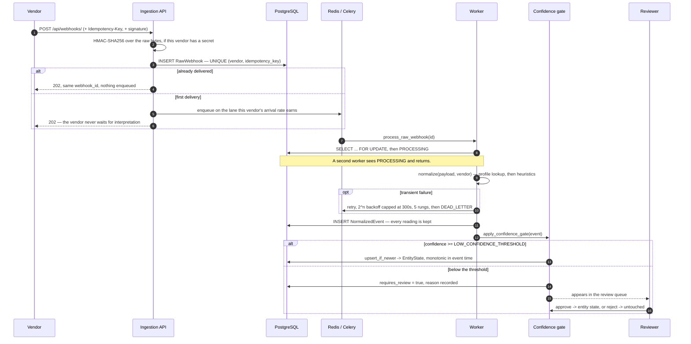
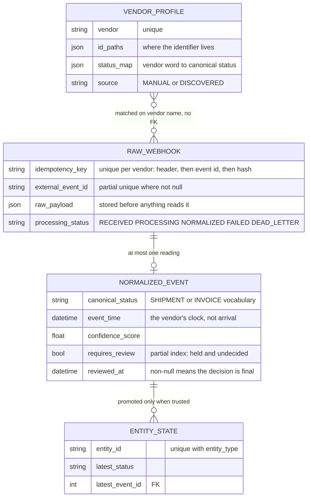

# Webhook Ingestion & Normalisation Service

Every carrier and billing vendor describes the same event differently. One sends
`{"event": "delivered"}`, another `{"status_text": "Cargo released to consignee"}`, a third
`{"type": "parcel.out_for_delivery"}`. This service accepts all of them and answers one
question consistently: **what is the current status of this shipment or invoice?**

The interesting part is not that a model reads the payloads. It is that the service
**refuses to act on a reading it is not sure about**: a low-confidence normalisation is
recorded in full, then withheld from the system's state until a person approves it.
Everything else here — the queue, the retry ladder, vendor profiles, replay, calibration —
exists to make that gate either less necessary or easier to work.

Django 5.2 + DRF, Celery, PostgreSQL, Redis. An LLM interprets payloads when
`OPENAI_API_KEY` is set and a rule engine does when it is not; every path through the
service works either way, every model call in the test suite is mocked, and the transcripts
below were captured with no key present.

## Watch it refuse to guess

Real output from a local run — Django on `:8100`, one Celery worker, PostgreSQL and Redis.
A delivery whose vocabulary the normaliser recognises goes straight through, and a
redelivery under the same `Idempotency-Key` is the same webhook, not a second one:

```console
$ curl -sX POST :8100/api/webhooks/ -H 'X-Webhook-Vendor: Maersk' \
    -H 'Idempotency-Key: MRSK-EVT-2026-000911' -d '{"container_no":"MAEU240498712",
    "event_description":"delivered","event_time":"2026-09-26T10:15:00+00:00"}'
{"status": "accepted", "webhook_id": "046ddb5d-483c-47ec-abb2-1cd7abdfd1c7"}

$ curl -s ':8100/api/entities/state/?entity_type=SHIPMENT&entity_id=MAEU240498712'
{"entity_type": "SHIPMENT", "entity_id": "MAEU240498712", "latest_status": "DELIVERED",
 "latest_event_time": "2026-09-26T10:15:00Z", "latest_event_id": 1}

$ curl -sX POST :8100/api/webhooks/ ... -d '{...,"redelivery":2}'   # same key, new body
{"status": "accepted", "webhook_id": "046ddb5d-483c-47ec-abb2-1cd7abdfd1c7"}
```

`"Cargo released to consignee"` is not in the canonical vocabulary. The normaliser abstains
rather than guessing, and the gate keeps the event out of entity state while recording it
in full, with the reason and the numbers behind it:

```console
$ curl -sX POST :8100/api/webhooks/ -H 'X-Webhook-Vendor: Ocean Network Express' \
    -d '{"shipment_reference":"ONEY9384999","status_text":"Cargo released to consignee",
    "occurred_at":"2026-09-26T09:00:00+09:00"}'
{"status": "accepted", "webhook_id": "963c14c1-d75f-4c60-8ccb-63c9aa8e948f"}

$ curl -sG :8100/api/normalization/review-queue/ -d 'vendor=Ocean Network Express'
{"count": 1, "limit": 50, "offset": 0, "next_offset": null,
 "results": [{"id": 2, "entity_id": "ONEY9384999", "canonical_status": "IN_TRANSIT",
   "confidence_score": 0.3, "requires_review": true, "reviewed_at": null,
   "review_reason": "confidence 0.30 is below the 0.70 threshold"}]}

$ curl -s -w '\nHTTP %{http_code}\n' ':8100/api/entities/state/?...&entity_id=ONEY9384999'
{"detail":"Not found."}
HTTP 404

$ # and in the worker log
{"level": "WARNING", "message": "normalization_held_for_review", "event_id": 2,
 "entity_id": "ONEY9384999", "confidence": 0.3, "threshold": 0.7}
```

A person then rules on it, once. Approval is the human supplying the confidence the
normaliser lacked, rejection leaves entity state exactly as it was, and a second decision
is refused because the audit trail has to keep saying what actually happened:

```console
$ curl -sX POST :8100/api/normalization/review-queue/2/ -d '{"decision":"approve"}'
{"id": 2, "decision": "approve", "entity_state_updated": true}

$ curl -s -w '\nHTTP %{http_code}\n' ... -d '{"decision":"reject"}'
{"detail":"event 2 was already reviewed at 2026-09-26 15:53:43.734726+00:00"}
HTTP 409
```

The queue is worked through this API or through the Django admin, which registers the same
models and calls the same `apply_review_decision()`, so the two cannot drift. There is no
bespoke frontend: [the admin list](docs/screenshots/review-queue.png) is the whole review
surface.

## The journey of one delivery


```mermaid
sequenceDiagram
    autonumber
    participant V as Vendor
    participant API as Ingestion API
    participant DB as PostgreSQL
    participant R as Redis / Celery
    participant W as Worker
    participant G as Confidence gate
    participant H as Reviewer

    V->>API: POST /api/webhooks/ (+ Idempotency-Key, + signature)
    API->>API: HMAC-SHA256 over the raw bytes, if this vendor has a secret
    API->>DB: INSERT RawWebhook — UNIQUE (vendor, idempotency_key)
    alt already delivered
        API-->>V: 202, same webhook_id, nothing enqueued
    else first delivery
        API->>R: enqueue on the lane this vendor's arrival rate earns
        API-->>V: 202 — the vendor never waits for interpretation
    end
    R->>W: process_raw_webhook(id)
    W->>DB: SELECT ... FOR UPDATE, then PROCESSING
    Note over W,DB: A second worker sees PROCESSING and returns.
    W->>W: normalize(payload, vendor) — profile lookup, then heuristics
    opt transient failure
        W->>R: retry, 2^n backoff capped at 300s, 5 rungs, then DEAD_LETTER
    end
    W->>DB: INSERT NormalizedEvent — every reading is kept
    W->>G: apply_confidence_gate(event)
    alt confidence >= LOW_CONFIDENCE_THRESHOLD
        G->>DB: upsert_if_newer -> EntityState, monotonic in event time
    else below the threshold
        G->>DB: requires_review = true, reason recorded
        G-->>H: appears in the review queue
        H->>G: approve -> entity state, or reject -> untouched
    end
```

## What ends up in the tables

The shape of the relationships is the argument: a raw payload is stored before anything
interprets it, a reading is derived from it, and only a *trusted* reading moves state.


```mermaid
erDiagram
    RAW_WEBHOOK ||--o| NORMALIZED_EVENT : "at most one reading"
    NORMALIZED_EVENT ||--o{ ENTITY_STATE : "promoted only when trusted"
    VENDOR_PROFILE }o--o{ RAW_WEBHOOK : "matched on vendor name, no FK"

    RAW_WEBHOOK {
        string idempotency_key "unique per vendor: header, then event id, then hash"
        string external_event_id "partial unique where not null"
        json raw_payload "stored before anything reads it"
        string processing_status "RECEIVED PROCESSING NORMALIZED FAILED DEAD_LETTER"
    }
    NORMALIZED_EVENT {
        string canonical_status "SHIPMENT or INVOICE vocabulary"
        datetime event_time "the vendor's clock, not arrival"
        float confidence_score
        bool requires_review "partial index: held and undecided"
        datetime reviewed_at "non-null means the decision is final"
    }
    ENTITY_STATE {
        string entity_id "unique with entity_type"
        string latest_status
        int latest_event_id FK
    }
    VENDOR_PROFILE {
        string vendor "unique"
        json id_paths "where the identifier lives"
        json status_map "vendor word to canonical status"
        string source "MANUAL or DISCOVERED"
    }
```

## Teaching it a vendor beats reviewing that vendor forever

Hand `/vendor-profiles/discover/` four real payloads and it proposes where the identifier,
status and timestamp live. Note what it does *not* do — it leaves the phrase it cannot
interpret unmapped and says so, rather than inventing a meaning for it:

```console
$ curl -sX POST :8100/api/normalization/vendor-profiles/discover/ -d @samples.json
{"method": "statistical", "sample_count": 4, "persisted": true,
 "unmapped_statuses": ["cargo_released_to_consignee"],
 "profile": {"vendor": "Ocean Network Express", "entity_type": "SHIPMENT",
   "id_paths": ["shipment_reference", "status_text"], "time_paths": ["occurred_at"],
   "status_map": {"delivered": "DELIVERED", "in_transit": "IN_TRANSIT"}}}
```

With a key set a model-assisted reader runs alongside the statistical one, but it never
gets the last word: every path it proposes is checked against the flattened samples and
dropped if it is not there, and every status against the canonical vocabulary. A person
`PUT`s the missing word onto the profile and replays the held webhook — the raw payload was
stored before anything interpreted it, so there is something to replay — and the event
leaves the queue (`count` 1 → 0) with `"latest_status": "DELIVERED"` reaching entity state,
without anybody having ruled on it.

Whether the threshold sits in the right place is a question the system can partly answer
about itself: `manage.py calibration_report` reads reviewers' decisions back per vendor,
and is deliberately one-directional about what it proves — every reviewed event is one the
gate already held, so the data can show a threshold is too *high*, never too low.

## Running it

```bash
docker compose up --build
```

That is the whole thing: PostgreSQL, Redis, the web process and two Celery workers,
migrations, a demo admin login and four vendors' worth of seeded traffic. On a clean build
from an empty volume, `/api/health/` answered 200 after about 12 seconds with all five
containers `(healthy)`, 24 webhooks seeded and 9 held at the gate. Ports are 8100 (web),
8101 (PostgreSQL), 8102 (Redis). Without containers — the path every transcript above came
from — point it at a local PostgreSQL and Redis:

```bash
uv sync --extra dev
export POSTGRES_HOST=localhost REDIS_URL=redis://localhost:6379/0 CACHE_URL=$REDIS_URL
python manage.py migrate && python manage.py seed_demo && python manage.py runserver 8100
celery -A config worker --queues normalization,normalization.bulk --loglevel INFO
```

**No API key is needed.** With `OPENAI_API_KEY` unset the rule-based normaliser is selected
and every feature above still works; set a key and the model backend is selected instead,
and nothing else changes. API docs are at `/api/docs/`, the review queue at `/admin/`,
liveness at `/api/health/`. `scripts/send_webhooks.py --count 20` sends synthetic traffic.

`.env.example` is the full settings list, all with working defaults. The four that change
behaviour rather than plumbing: `LOW_CONFIDENCE_THRESHOLD` (`0.7`) is the gate;
`NORMALIZATION_BACKEND` (`auto`) forces a reader instead of picking one by key presence;
`WEBHOOK_SIGNING_SECRETS` / `WEBHOOK_REQUIRE_SIGNATURE` turn on signature checking; and
`CACHE_URL` **must** be set whenever more than one process runs, because it backs both the
profile cache and the per-vendor arrival counter.

That counter exists because one queue plus one worker pool makes one vendor's burst
everybody's latency. Arrivals are counted per vendor in a fixed cache window — approximate
by design, never a write on the ingest path — and past `NOISY_VENDOR_BURST` that vendor's
work routes to `normalization.bulk`, served by its own worker. With the limit set to 5 and
nine webhooks from one vendor, five took the live lane, a `vendor_burst_bulkheaded` warning
fired at arrival 6, and the remaining four went to the bulk lane. An unreachable cache
degrades to "default queue"; operator replays take the bulk lane too, so a backfill cannot
push live traffic behind it.

Tests: `POSTGRES_HOST=localhost python -m pytest -q` — **270, all passing**, with `ruff
check .` and `ruff format --check .` clean. The suite needs a real PostgreSQL because the
pipeline does (`SELECT ... FOR UPDATE`, a partial index) and makes no network call: the
OpenAI client class is replaced wholesale and an autouse fixture blanks `OPENAI_API_KEY`, so
no test can reach the model backend by accident. They concentrate on: that confidence is
honest (the weakest signal governs the score, not the average, so a perfectly recognised
entity type cannot hide a guessed status); that the gate holds at the exact boundary, so the
comparison cannot flip to `<=` unnoticed; that the retry ladder ends; that a redelivery is a
no-op by header key, event id and payload hash; that a forged body is refused; and that
entity state is monotonic in event time, so a late `in_transit` cannot overwrite a
`delivered`.

## Three things that were wrong, and one that was missing

**The dead-letter branch was unreachable.** The retry handler caught
`MaxRetriesExceededError` to end the ladder — but Celery only raises that when `retry()` is
called *without* an `exc`; given one, it re-raises the original exception instead. So the
branch never ran, and an exhausted webhook sat in `FAILED` forever while every delivery
reported an error. The fix catches both endings, proved by reverting it and watching the new
tests fail.

**The documented `Idempotency-Key` header was ignored entirely.** The key came from the
vendor's event id, falling back to a payload hash; the header a vendor sent was never read,
though it is that vendor's own strongest statement about which deliveries are the same
event. It is now consulted first, well ahead of the hash — hashing alone collapses two
distinct events that serialise identically, such as two scans of the same parcel worded the
same way.

**The JSON log formatter silently dropped fields.** It carried a hardcoded allow-list of
names, so anything passed via `extra=` that nobody had added to the list never appeared.
`normalization_held_for_review` was logging the threshold it compared against and the id of
the event it held, and neither survived — the one line an operator reads to understand a
hold was missing both numbers that explained it. It now emits every field that is not a
standard `LogRecord` attribute.

**Signature verification did not exist.** Per-vendor HMAC-SHA256 over the raw request bytes,
compared in constant time, now runs on ingest — opt-in, so the no-config demo still runs. A
vendor with no configured secret is accepted exactly as before, and
`WEBHOOK_REQUIRE_SIGNATURE=true` ends that permissiveness once a deployment has onboarded its
vendors. With `WEBHOOK_SIGNING_SECRETS='Maersk=s3cret'` set, an unsigned or mis-signed Maersk
body gets `401 {"detail": "Missing X-Webhook-Signature header."}`, a correctly signed one
`202`, and a vendor with no secret still `202`.

## The HTTP surface

| Endpoint | Purpose |
|---|---|
| `POST /api/webhooks/` | Ingest. `202`; `400` on a non-object payload; `401` on a bad signature |
| `POST /api/webhooks/{id}/replay/` | Re-run a stored payload. `409` if a worker holds it — `{"force": true}` overrides |
| `GET /api/entities/state/` | What the system believes about one entity. `?entity_type=&entity_id=` |
| `GET /api/normalization/review-queue/` | What the gate held and nobody has ruled on. `?vendor=&limit=&offset=` |
| `POST /api/normalization/review-queue/{id}/` | `{"decision": "approve"\|"reject"}`. `409` if already decided |
| `GET /api/normalization/low-confidence/` | Every event below a threshold, whatever the gate did at the time |
| `GET /api/normalization/calibration/` | Per-vendor calibration of the gate |
| `POST /api/normalization/vendor-profiles/discover/` | Propose a profile from samples. `{"persist": true}` saves it |

Vendor profiles are also full CRUD at `/api/normalization/vendor-profiles/`, and
`/api/docs/` serves the generated schema.

## Known gaps

- **Nothing on the API is authenticated except the webhook signature.** The review queue,
  replay, the profile endpoints and entity state are open to whoever can reach them.
- **Signatures do not bind a timestamp.** The idempotency key makes a replay of an
  *already-seen* event harmless, but a signed body never delivered is not time-limited.
- **Confidence is not probability-calibrated.** The report says whether the threshold
  separates approvals from rejections; it does not make 0.75 mean "right 75% of the time".
- **One threshold for every entity type and vendor.** A wrong invoice status probably
  deserves a higher bar than a wrong shipment status.
- **The bulk lane is a bulkhead, not a fair scheduler**, and burst detection is per web
  process when `CACHE_URL` is unset, so two gunicorn workers count separately.
- **Dead-lettered webhooks have no triage surface** — visible in the admin and replayable
  one at a time, with no bulk requeue.
